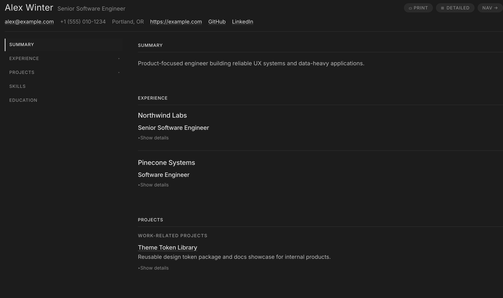
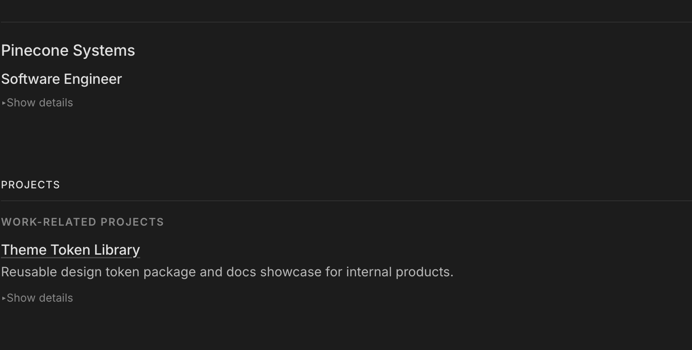

# jsonresume-theme-wintermuted

Open-source JSON Resume theme extracted from the private CV repository.

## Preview

These screenshots use the bundled Alex Winter sample resume rendered with this theme.

### Summary And Experience



### Projects



## Install

```bash
npm install jsonresume-theme-wintermuted
```

The shared `@wintermuted/ui-theme` package is installed automatically as a dependency of this theme.

For local development before publish:

```bash
npm install ../jsonresume-theme-wintermuted
```

## Usage with resumed

```bash
resumed render resume.json -t jsonresume-theme-wintermuted -o resume.html
```

## Scripts

The package includes these local preview scripts:

- `npm run preview:render` renders `examples/resume.sample.json` to `examples/preview.html`
- `npm run preview:serve` serves the repository at `http://localhost:4175/`
- `npm run preview:open` opens `http://localhost:4175/examples/preview.html`
- `npm run preview:view` renders the sample, ensures a local server is available, and opens the preview page

## Local Viewing

This repository includes a sample resume payload for quickly previewing theme changes.

```bash
npm run preview:render
npm run preview:serve
npm run preview:open
```

`preview:render` uses the local theme renderer (`index.js`) directly, so it works in this repository without publishing or npm linking.

Recommended local preview flow:

1. Run `npm run preview:render` after changing templates, helpers, or CSS.
2. Run `npm run preview:serve` to start the local preview server.
3. Run `npm run preview:open` to open the rendered sample resume.
4. Use `npm run preview:view` when you want the render, server check, and open steps handled for you.

Files:

- `examples/resume.sample.json`
- `examples/preview.html` (generated)

You can also run:

```bash
npm run preview:view
```

This renders the sample and starts a local server on `http://localhost:4175/`.
If a preview server is already running on that port, the script reuses it and opens the preview page.

## GitHub Pages Publishing

This repository publishes a live preview of the sample resume through GitHub Pages using Actions.

- Pushes to `main` publish production content to the root Pages site.
- Pull requests to `main` publish isolated previews under `previews/pr-<number>/`.
- Closing a pull request removes its preview directory from `gh-pages`.

Workflows:

- `.github/workflows/deploy-pages.yml`
- `.github/workflows/cleanup-pr-preview.yml`

## What this package contains

- `resume.hbs` main Handlebars template
- `partials/` section partials
- `helpers/` helper functions
- `style.css` theme-specific styles
- Runtime CSS token inlining from `@wintermuted/ui-theme`

## Publish

```bash
npm publish --access public
```

For automated publishing, this repo is configured for npm trusted publishing from GitHub Actions.

Release flow:

1. Merge or push changes to `main`.
2. The `Publish And Release` workflow computes the next patch version from the latest `v*` tag.
3. The workflow updates `package.json` and `package-lock.json`, commits the version bump back to `main`, and publishes the package to npm.
4. The workflow creates and pushes the matching `v<version>` tag.
5. The workflow creates the corresponding GitHub release.

Because trusted publishing is enabled, no long-lived `NPM_TOKEN` secret is required for the GitHub Actions publish step.
